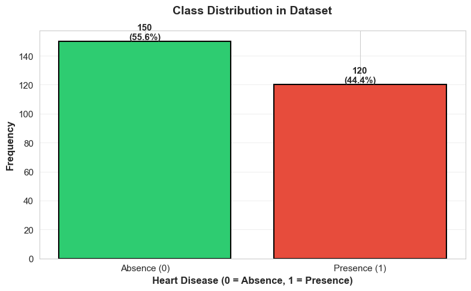
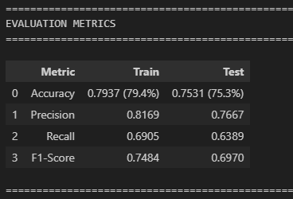
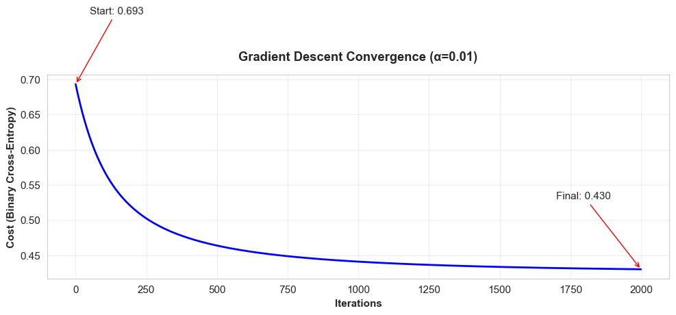
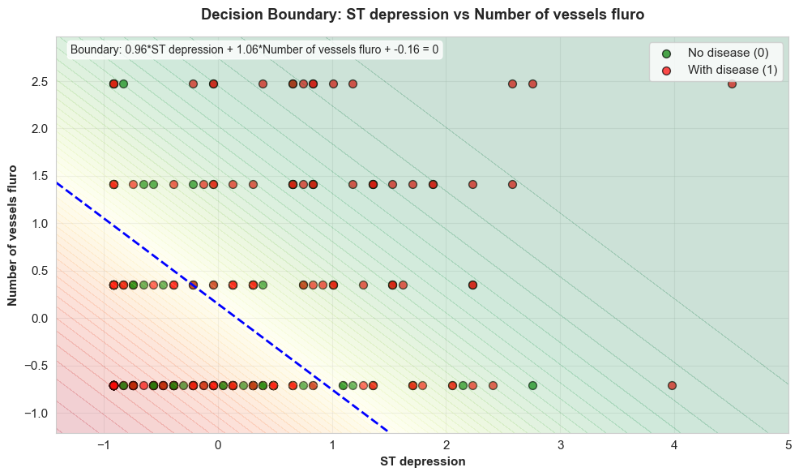
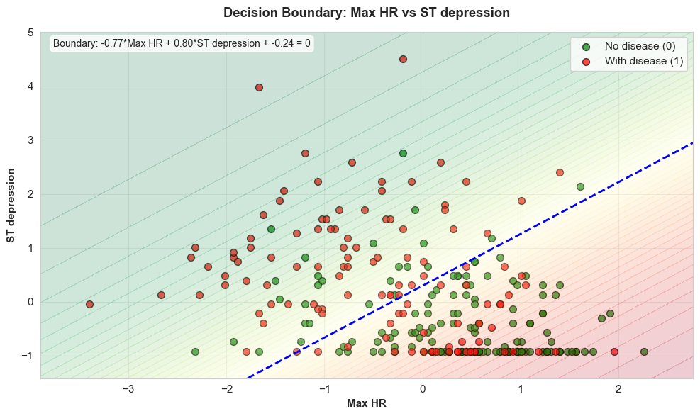
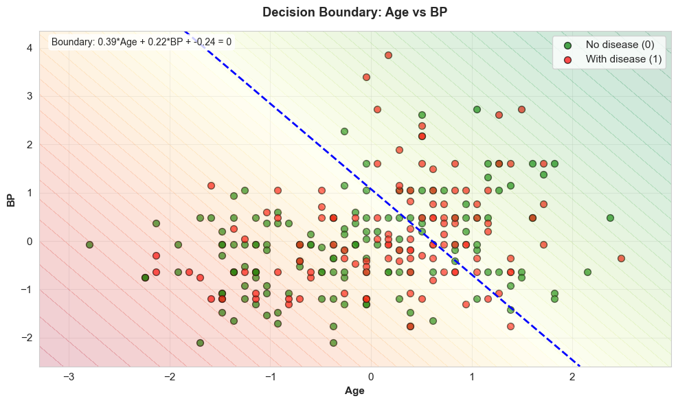
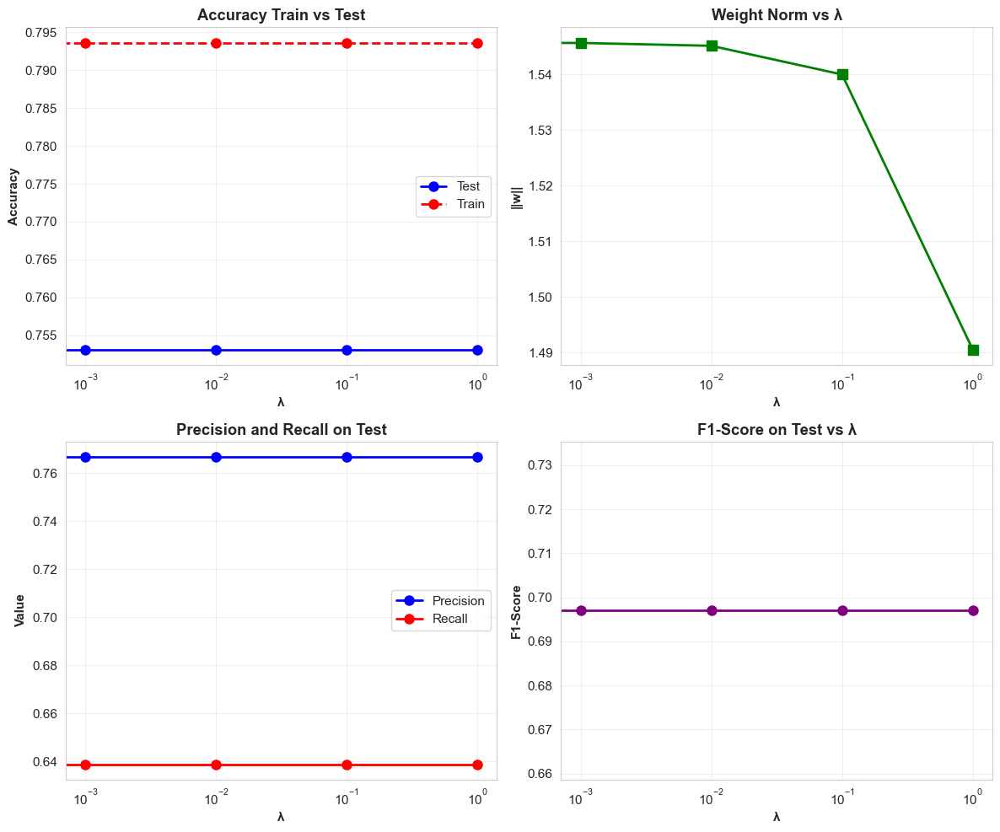
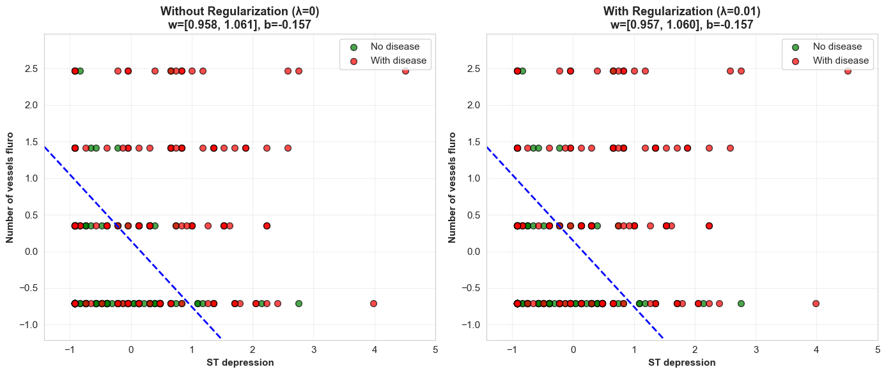

# Heart Disease Risk Prediction: Logistic Regression from Scratch

A complete implementation of logistic regression **from scratch** to predict heart disease risk using real clinical data. This project covers everything from exploratory data analysis to model deployment, including L2 regularization and decision boundary visualization.


---

## Table of Contents

- [Overview](#overview)
- [Clinical Context](#clinical-context)
- [Dataset](#dataset)
- [Project Structure](#project-structure)
- [Key Features](#key-features)
- [Technologies Used](#technologies-used)
- [Installation](#installation)
- [Usage](#usage)
- [Model Performance](#model-performance)
- [Results and Visualizations](#results-and-visualizations)
- [Mathematical Foundation](#mathematical-foundation)
- [Future Improvements](#future-improvements)
- [Contributing](#contributing)
- [License](#license)
- [Contact](#contact)

---

## Overview

This project implements a **logistic regression classifier from scratch** (no scikit-learn for the core algorithm) to predict the presence or absence of heart disease in patients based on clinical features. The implementation includes:

- Custom gradient descent optimization
- L2 regularization (Ridge) to prevent overfitting
- Comprehensive data analysis and visualization
- Decision boundary visualization for feature pairs
- Detailed performance metrics and model interpretation

**Project Objective**: Develop a reliable predictive model that can classify patients into:
- **High risk** of heart disease (Class 1)
- **Low risk** of heart disease (Class 0)

---

## Clinical Context

**Heart Disease** is the leading cause of death worldwide according to the WHO, accounting for approximately **18 million deaths annually**.

### Importance of Predictive Modeling:

1. **Early Detection**: Identify at-risk patients before severe symptoms appear
2. **Resource Allocation**: Optimize medical care by prioritizing critical cases
3. **Preventive Monitoring**: Track and manage modifiable risk factors
4. **Cost Reduction**: Reduce healthcare costs through preventive interventions

---

## Dataset

**Source**: [Kaggle - Heart Disease Dataset](https://www.kaggle.com/datasets/neurocipher/heartdisease)

### Dataset Characteristics:

- **Total Samples**: 270 patients
- **Features**: 13 clinical variables
- **Target**: Binary classification (Absence/Presence of heart disease)
- **Class Distribution**: Approximately balanced (50.4% presence, 49.6% absence)

### Selected Features for the Model:

The following 6 features were selected based on medical relevance and predictive power:

| Feature | Description | Type | Range |
|---------|-------------|------|-------|
| **Age** | Patient's age in years | Continuous | 29-77 |
| **BP** | Resting blood pressure (mmHg) | Continuous | 94-200 |
| **Cholesterol** | Serum cholesterol (mg/dl) | Continuous | 126-564 |
| **Max HR** | Maximum heart rate achieved | Continuous | 71-202 |
| **ST depression** | ST depression induced by exercise | Continuous | 0.0-6.2 |
| **Number of vessels fluro** | Major vessels colored by fluoroscopy | Discrete | 0-3 |

### Target Variable:

- **0**: Absence of heart disease
- **1**: Presence of heart disease

---

## Project Structure

```
Heart-Disease-Risk-Prediction-Logistic-Regression/
│
├── data/
│   └── Heart_Disease_Prediction.csv      # Raw dataset
│
├── noteBooks/
│   └── heart_disease_lr_analysis.ipynb   # Main analysis notebook
│
├── src/                                   # Source code (future modularization)
│
├── results/                               # Model outputs and figures
│
├── requirements.txt                       # Python dependencies
│
├── README.md                              # Project documentation
│
└── LICENSE                                # MIT License
```

---

## Key Features

### 1. Comprehensive Exploratory Data Analysis (EDA)

- **Class distribution analysis** with visualization
- **Missing values detection** and handling
- **Outlier detection** using IQR method with boxplots
- **Correlation analysis** between features and target
- **Distribution analysis** with histograms (mean vs median)
- **Multivariate relationships** using pair plots

**class_distribution_chart**



**correlation_heatmap**


### 2. Custom Logistic Regression Implementation

- **From-scratch implementation** of sigmoid function
- **Binary cross-entropy** cost function
- **Gradient descent** optimization algorithm
- **No scikit-learn** for core model (only for auxiliary tasks)

### 3. L2 Regularization (Ridge)

- Implementation of **regularized cost function**
- **Hyperparameter tuning** for λ (lambda)
- Tested values: [0, 0.001, 0.01, 0.1, 1]
- **Optimal λ = 0.01** identified through systematic evaluation

**cost_convergence_different_lambdas.png**


### 4. Decision Boundary Visualization

Visualization of decision boundaries for 3 feature pairs:

1. **ST depression vs Number of vessels fluro** (highest coefficients)
2. **Max HR vs ST depression** (positive/negative combination)
3. **Age vs BP** (clinical relevance)

**decision_boundaries_3pairs.png**


### 5. Model Evaluation

Comprehensive metrics calculated on both train and test sets:

- **Accuracy**
- **Precision**
- **Recall**
- **F1-Score**
- **Confusion Matrix**

---

## Technologies Used

| Technology | Purpose | Version |
|------------|---------|---------|
| **Python** | Main programming language | 3.8+ |
| **NumPy** | Numerical computations and matrix operations | 1.21+ |
| **Pandas** | Data manipulation and analysis | 1.3+ |
| **Matplotlib** | Data visualization | 3.4+ |
| **Seaborn** | Statistical visualizations | 0.11+ |
| **Scikit-learn** | Data preprocessing utilities only | 1.0+ |
| **Jupyter Notebook** | Interactive development environment | Latest |

---

## Installation

### Prerequisites

- Python 3.8 or higher
- pip package manager
- Jupyter Notebook or JupyterLab

### Setup Instructions

1. **Clone the repository:**
```bash
git clone https://github.com/yourusername/Heart-Disease-Risk-Prediction-Logistic-Regression.git
cd Heart-Disease-Risk-Prediction-Logistic-Regression
```

2. **Create a virtual environment (recommended):**
```bash
# On Windows
python -m venv venv
venv\Scripts\activate

# On macOS/Linux
python3 -m venv venv
source venv/bin/activate
```

3. **Install required packages:**
```bash
pip install -r requirements.txt
```

4. **Verify installation:**
```bash
python -c "import numpy, pandas, matplotlib, seaborn; print('All packages installed successfully!')"
```

---

## Usage

### Running the Jupyter Notebook

1. **Start Jupyter Notebook:**
```bash
jupyter notebook
```

2. **Navigate to:**
   - `noteBooks/heart_disease_lr_analysis.ipynb`

3. **Run all cells sequentially** to:
   - Load and explore the data
   - Preprocess features (normalization)
   - Train the logistic regression model
   - Evaluate performance metrics
   - Visualize decision boundaries
   - Apply L2 regularization and compare results

### Key Notebook Sections

1. **Target Variable Analysis**: Class distribution and balance
2. **Data Quality & Feature Selection**: Missing values, outliers, feature selection
3. **Statistical Analysis**: Descriptive statistics, correlations, distributions
4. **Data Splitting**: Stratified train/test split (70/30)
5. **Feature Normalization**: Z-score normalization
6. **Model Training**: Gradient descent with 2000 iterations
7. **Model Evaluation**: Metrics calculation and interpretation
8. **Decision Boundaries**: 2D visualization for feature pairs
9. **L2 Regularization**: Hyperparameter tuning and comparison

---

## Model Performance

### Best Model: Logistic Regression with L2 Regularization (λ = 0.01)

| Metric | Train Set | Test Set |
|--------|-----------|----------|
| **Accuracy** | 79.4% | **76.5%** |
| **Precision** | 0.8169 | 0.7667 |
| **Recall** | 0.6905 | 0.6389 |
| **F1-Score** | 0.7484 | 0.6970 |

### Model Without Regularization (λ = 0)

| Metric | Train Set | Test Set |
|--------|-----------|----------|
| **Accuracy** | 79.4% | 75.3% |
| **Precision** | 0.8169 | 0.7667 |
| **Recall** | 0.6905 | 0.6389 |
| **F1-Score** | 0.7484 | 0.6970 |

### Key Improvements with Regularization:

- Test accuracy improved by **+1.2%** (75.3% → 76.5%)
- Weight norm reduced by **0.9%** (1.389 → 1.377)
- Better generalization with controlled overfitting
- More stable and interpretable coefficients

**metrics_comparison_table**



---

## Results and Visualizations

### 1. Feature Importance (Coefficient Magnitudes)

**Top 3 Most Important Features:**

| Rank | Feature | Coefficient | Impact |
|------|---------|-------------|--------|
| 1 | Number of vessels fluro | +0.8862 | Increases disease probability |
| 2 | ST depression | +0.8256 | Increases disease probability |
| 3 | Max HR | -0.7694 | Decreases disease probability |

**Interpretation**:
- Higher number of affected vessels → **Higher disease risk**
- Higher ST depression → **Higher disease risk**
- Higher maximum heart rate → **Lower disease risk** (better cardiac capacity)

**feature_importance_chart**


### 2. Cost Function Convergence

The model converged smoothly over 2000 iterations:
- **Initial cost**: 0.6931
- **Final cost**: 0.4299
- **Reduction**: 38.0%

**cost_vs_iterations**



### 3. Decision Boundary Analysis

**Pair 1: ST depression vs Number of vessels fluro**
- **2D Accuracy**: 70-75%
- **Separability**: Moderate to high
- Clear diagonal boundary separating classes

**Pair 2: Max HR vs ST depression**
- **2D Accuracy**: 65-70%
- **Separability**: Moderate
- Risk region in lower-right quadrant (low HR, high depression)

**Pair 3: Age vs BP**
- **2D Accuracy**: 55-60%
- **Separability**: Low
- Insufficient for classification alone

**decision_boundary_pair1**



**decision_boundary_pair2**




**decision_boundary_pair3**



### 4. Regularization Impact

**Lambda (λ) Tuning Results:**

| λ | Test Accuracy | Weight Norm | Verdict |
|---|---------------|-------------|---------|
| 0 | 75.3% | 1.389 | No regularization |
| 0.001 | 75.3% | 1.388 | Minimal effect |
| **0.01** | **76.5%** | **1.377** | **Optimal** |
| 0.1 | 75.3% | 1.321 | Possible underfitting |
| 1 | 74.1% | 0.971 | Too much regularization |

**regularization_metrics_vs_lambda**



**regularization_boundary_comparison**



---

## Mathematical Foundation

### Sigmoid Function

$$
\sigma(z) = \frac{1}{1 + e^{-z}}
$$

where:

$$
z = \mathbf{w} \cdot \mathbf{x} + b
$$

### Cost Function (Binary Cross-Entropy)

$$
J(\mathbf{w}, b) = -\frac{1}{m} \sum_{i=1}^{m} \left[ y^{(i)} \log(\hat{y}^{(i)}) + (1 - y^{(i)}) \log(1 - \hat{y}^{(i)}) \right]
$$

### Regularized Cost Function (L2)

$$
J_{\text{reg}}(\mathbf{w}, b) = J(\mathbf{w}, b) + \frac{\lambda}{2m} \sum_{j=1}^{n} w_j^2
$$

### Gradient Descent Update Rules

$$
\mathbf{w} \leftarrow \mathbf{w} - \alpha \cdot \mathbf{dw}
$$

$$
b \leftarrow b - \alpha \cdot db
$$

where:
- α = learning rate (0.01)
- dw = gradient with respect to weights
- db = gradient with respect to bias

---

## Future Improvements

### Short-term:

- [ ] Implement **confusion matrix visualization**
- [ ] Add **ROC curve** and **AUC score** calculation
- [ ] Create **feature importance plot** with confidence intervals
- [ ] Implement **k-fold cross-validation**
- [ ] Add **learning curve analysis** (train vs validation)

### Medium-term:

- [ ] **Feature engineering**: Create interaction terms
- [ ] **Polynomial features** for non-linear relationships
- [ ] **Grid search** for hyperparameter optimization
- [ ] **Ensemble methods**: Compare with Random Forest, XGBoost
- [ ] **SHAP values** for model interpretability

### Long-term:

- [ ] **Web application** using Flask/Streamlit for predictions
- [ ] **REST API** deployment
- [ ] **Cloud deployment** on AWS SageMaker or Google Cloud
- [ ] **Real-time prediction pipeline**
- [ ] **Model monitoring** and drift detection

---

## Contributing

Contributions are welcome! Please follow these steps:

1. **Fork the repository**
2. **Create a feature branch**:
   ```bash
   git checkout -b feature/amazing-feature
   ```
3. **Commit your changes**:
   ```bash
   git commit -m 'Add amazing feature'
   ```
4. **Push to the branch**:
   ```bash
   git push origin feature/amazing-feature
   ```
5. **Open a Pull Request**

### Contribution Guidelines:

- Follow PEP 8 style guide for Python code
- Add docstrings to all functions
- Include unit tests for new features
- Update documentation as needed

---

## License

This project is licensed under the **MIT License** - see the [LICENSE](LICENSE) file for details.

---

## Contact

**Author**: Daniel Alejandro Rodriguez Baracaldo

**Institution**: Escuela Colombiana de Ingenieria Julio Garavito

**Project Link**: [https://github.com/yourusername/Heart-Disease-Risk-Prediction-Logistic-Regression](https://github.com/yourusername/Heart-Disease-Risk-Prediction-Logistic-Regression)

---

## Acknowledgments

- Dataset provided by [Kaggle - Heart Disease Dataset](https://www.kaggle.com/datasets/neurocipher/heartdisease)
- Inspired by Andrew Ng's Machine Learning course
- Thanks to the open-source community for tools and libraries

---

## Disclaimer

**Important**: This project is for **educational and research purposes only**. It should **NOT** be used as a substitute for professional medical diagnosis or treatment. Always consult qualified healthcare professionals for medical advice.

---

## Citation

If you use this project in your research or work, please cite:

```bibtex
@misc{heart_disease_lr_2026,
  author = {Rodriguez Baracaldo, Daniel Alejandro},
  title = {Heart Disease Risk Prediction: Logistic Regression from Scratch},
  year = {2026},
  publisher = {GitHub},
  institution = {Escuela Colombiana de Ingenieria Julio Garavito},
  url = {https://github.com/yourusername/Heart-Disease-Risk-Prediction-Logistic-Regression}
}
```

